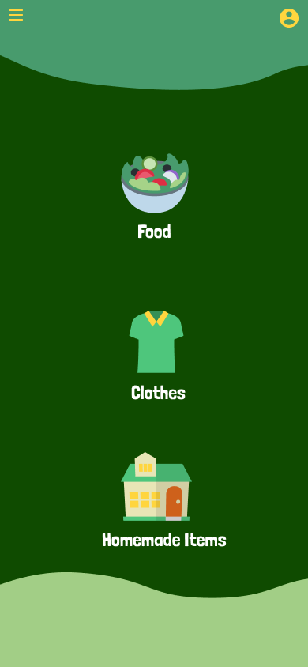

# DT Home Fresh

DT Home Fresh is a mobile application that serves as a comprehensive database of sellers who create unique, homemade items. Whether you're looking for handmade crafts, artisanal food products, or one-of-a-kind creations, our app connects you with local sellers who put their heart and soul into their work.

## Features

- Discover a wide variety of homemade products from local sellers.
- Browse through crafts, food, art, and more categories.

## Gallery
|Onboarding Screen|Categories Screen|
|------|------|
|||

## Documentation

- **Language**: Kotlin
- **Architecture**: Model View ViewModel (MVVM)
- **Libraries**: LiveData, ViewModel, Navigation Components, Data Binding

